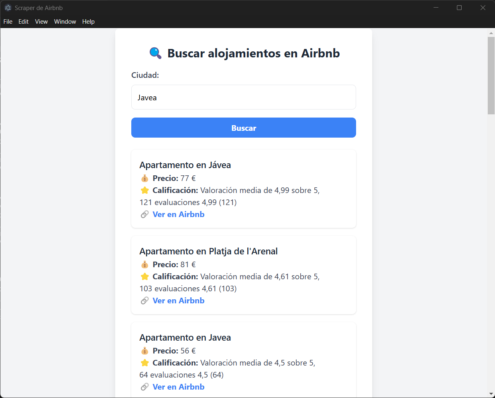
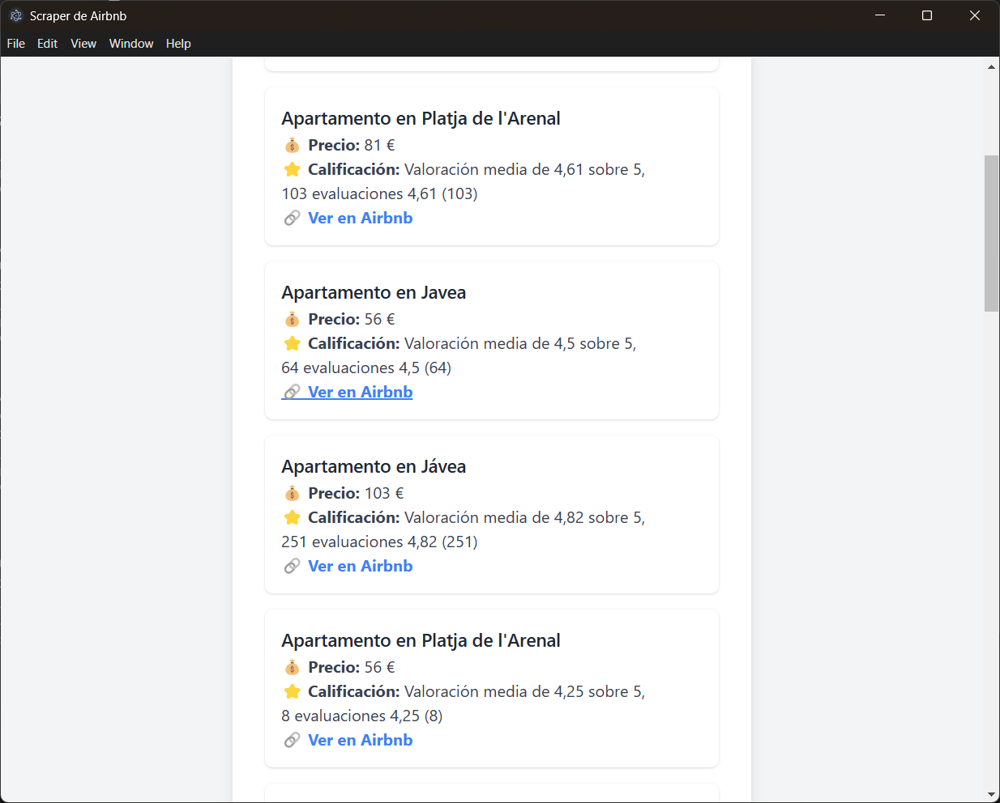
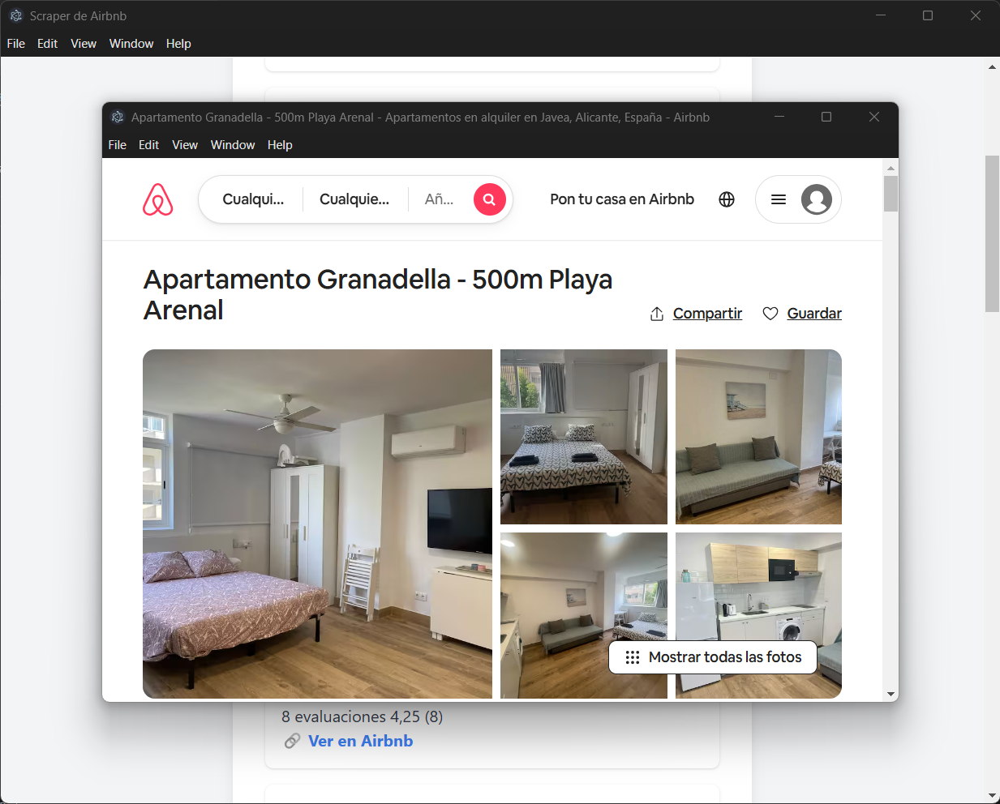

# ProyectoHector2oTrimestre

## 🏡 Aplicación de Escritorio con Electron y Puppeteer

Este proyecto es una aplicación de escritorio desarrollada con **Electron** y **Puppeteer** que permite a los usuarios buscar alojamientos en **Airbnb** ingresando el nombre de una ciudad. La aplicación realiza web scraping y muestra los resultados de forma organizada.

---

## 📌 **Características**

✅ **Interfaz intuitiva**: Permite ingresar una ciudad y buscar alojamientos disponibles.
✅ **Scraping dinámico**: Puppeteer extrae información de Airbnb en función de la ciudad introducida.
✅ **Visualización atractiva**: Los resultados se presentan con detalles como título, precio, calificación y un enlace directo a Airbnb.

---

## 📥 **Instalación**

**Aclaración**: La instalación debe realizarse desde una terminal *cmd*, desde *PS* no funcionará correctamente.
1. **Clona el repositorio**:
   ```bash
   git clone https://github.com/hectorl-m/ProyectoHector2oTrimestre.git
   cd ProyectoHector2oTrimestre
   ```
2. **Instala las dependencias**:
   ```bash
   npm install electron puppeteer
   ```

---

## 🚀 **Ejecución de la Aplicación**

Para iniciar la aplicación, usa el siguiente comando:
```bash
npm start
```

---

## 🛠 **Tecnologías Utilizadas**
- **Electron.js**: Para crear la interfaz de escritorio.
- **Puppeteer**: Para realizar web scraping en Airbnb.
- **TailwindCSS**: Para mejorar el diseño de la interfaz.
- **JavaScript**: Lenguaje de programación principal.

---

## 📷 **Capturas de Pantalla**






---

## 📄 **Licencia**
Este proyecto es de uso educativo y no está destinado a uso comercial. Airbnb tiene políticas sobre web scraping, por lo que se recomienda usarlo con fines personales y de aprendizaje.

📩 **Desarrollado por *Héctor Larrosa Martínez***
